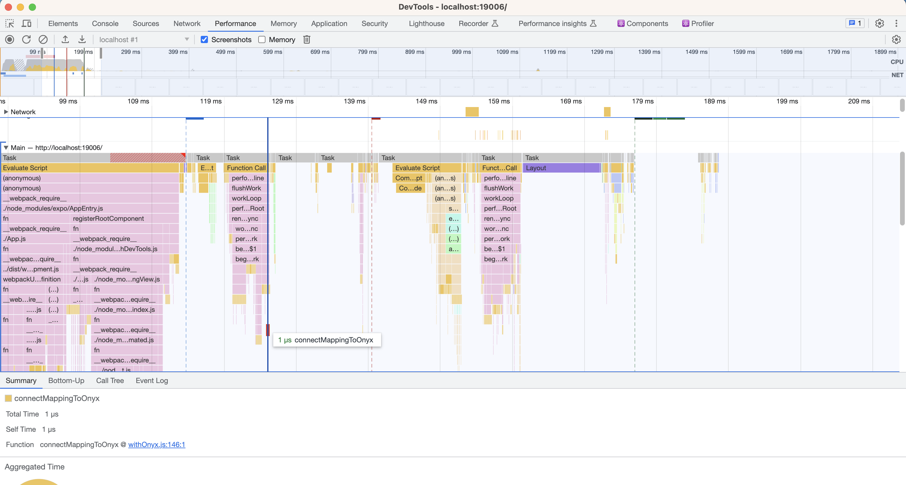
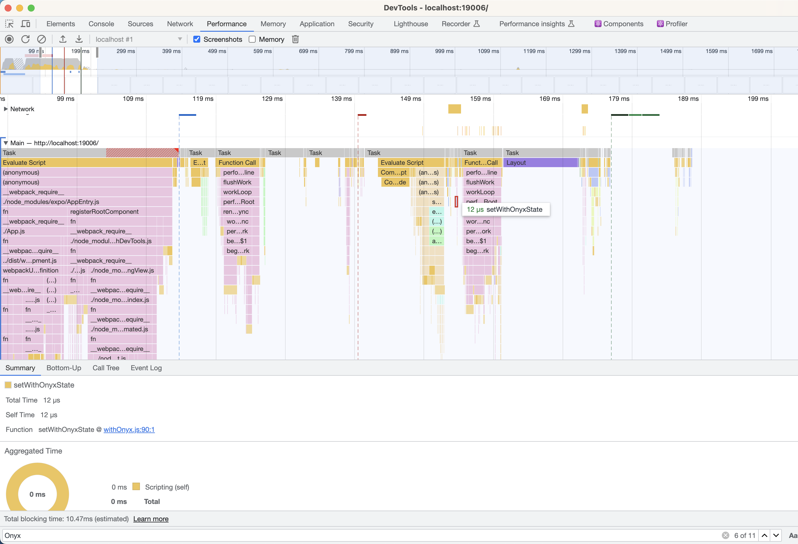
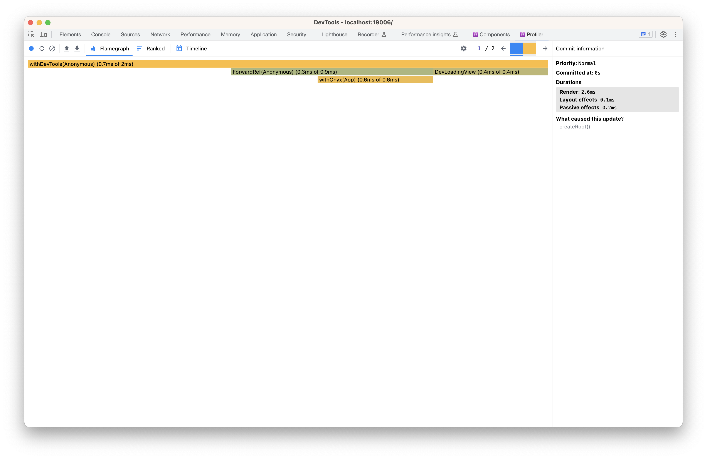
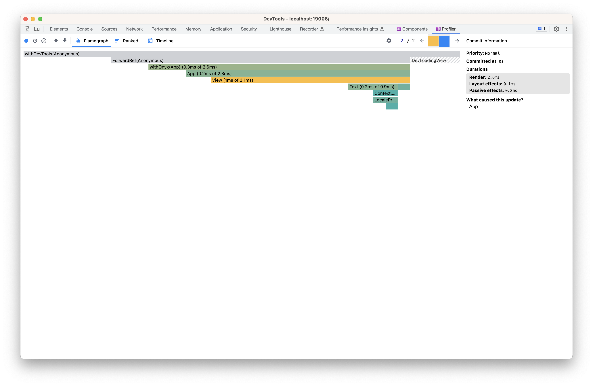

# Findings

1. App LCP went from ~200ms to ~700ms the moment we wrap the `App` with `withOnyx`.
2. The component is not rendered immediately, but is delayed.
Here you can see the app start:

And after some time, some tasks later, the data is actually send to the component:

This behaviour can also be observed in the react devtools, which show multiple commits to the rendering
of the component. This is bad performance wise, for the initial app render there should be just one commit:

The app renders, but without the App's content yet, as Onyx is blocking it:

Then, a second commit happens, once the data is available:

